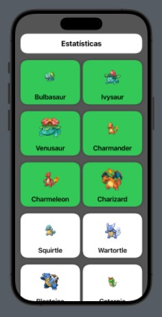
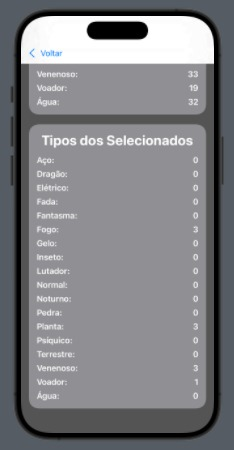
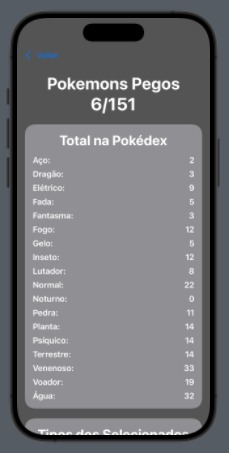

# FoundationProjectSwift

Aplicativo SwiftUI que consome a [PokéAPI](https://pokeapi.co/) para listar os 151 Pokémons originais, permitindo capturá-los virtualmente e visualizar estatísticas como tipos e força total.

---

##  Visão Geral do Projeto

Este projeto foi desenvolvido como parte do curso TIC Trilhas Mackenzie. Ele utiliza SwiftUI para criar uma interface interativa e moderna, permitindo que usuários:

- Visualizem uma lista dos Pokémons originais.
- Capturem Pokémons com um toque.
- Acompanhem estatísticas dos Pokémons capturados.
- Descubram o Pokémon mais forte e mais fraco com base em seus atributos.

---

##  Imagens do App


- Tela de lista de Pokémons
- 


- Tela de estatísticas
- 
    
- Detalhes de um Pokémon capturado
- 

---

## Estrutura do Código

### `Pokemon.swift` – Modelos de Dados

Define os modelos usados para representar Pokémons e seus detalhes:

- `Pokemon`: nome, URL, imagem e número.
- `PokemonDetail`: tipos e estatísticas.
- `TypeSlot`, `Stat`, `NamedAPIResource`: estruturas auxiliares para decodificação da API.

### `PokemonViewModel.swift` – Lógica de Negócio

Gerencia o estado do app e a comunicação com a PokéAPI:

- `fetchPokemon()`: busca os 151 Pokémons.
- `fetchDetail(for:)`: busca detalhes de um Pokémon.
- `toggleCapture(_:)`: captura ou libera um Pokémon.
- `totalByType()`: retorna a contagem por tipo.
- `strongestPokemon()` / `weakestPokemon()`: retorna o Pokémon mais forte/fraco.

### `ContentView.swift` – Interface Principal

Define a navegação por abas entre:

- `PokemonListView`: lista interativa dos Pokémons.
- `StatisticsView`: estatísticas dos Pokémons capturados.

---

##  Funcionalidades

| Funcionalidade              | Descrição                                                                 |
|----------------------------|---------------------------------------------------------------------------|
| Listagem de Pokémons       | Exibe os 151 Pokémons com imagens e nomes.                                |
| Captura de Pokémons        | Permite capturar Pokémons com um toque.                                   |
| Estatísticas por tipo      | Mostra quantos Pokémons de cada tipo foram capturados.                    |
| Mais forte / mais fraco    | Identifica o Pokémon com maior e menor soma de atributos.                 |
| Interface intuitiva        | Navegação por abas com SwiftUI.                                           |

---

##  Como Rodar o Projeto

1. Clone o repositório:
   ```bash
   git clone https://github.com/seu-usuario/FoundationProjectSwift.git
2. Abra o projeto no XCode.
3. Execute em um simulador ou dispositivo físico

## Ideias para melhorias
- Adicionar busca por nome
- Filtrar por tipo de pokemon
